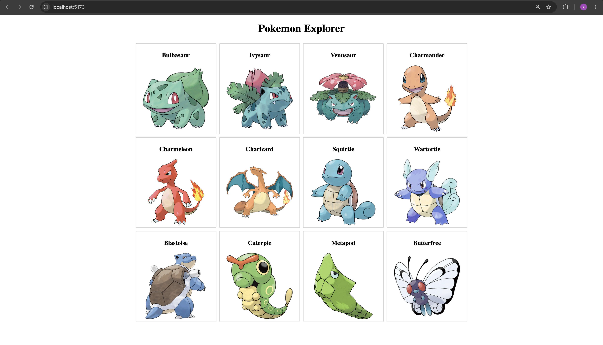

# Pokemon Explorer

Pokemon Explorer is a responsive React application that allows users to explore an infinite list of Pokemon. It fetches data from the [PokeAPI](https://pokeapi.co/) and implements infinite scrolling using the `IntersectionObserver` API.

The app is built with **React 18**, **Vite**, and **Jest** for testing, ensuring full test coverage with a focus on accessibility and performance.

## 📸 Demo

  
*A scrollable grid of Pokemon fetched from the PokeAPI.*

---

## 🔧 Features

- Infinite scroll for Pokemon list
- Clean and modular component structure
- IntersectionObserver-based lazy loading
- Fully tested with 100% test coverage
- Uses modern tooling (Vite, Babel, ESLint)
- Responsive and accessible layout

---

## 📁 Project Structure

```
pokemon-explorer/
├── public/
├── src/
│   ├── components/
│   │   └── PokemonList.jsx
│   ├── styles/
│   │   └── PokemonList.css
│   ├── __tests__/
│   │   └── PokemonList.test.jsx
│   ├── App.jsx
│   ├── main.jsx
│   └── index.css
├── jest.config.mjs
├── jest.setup.js
├── package.json
├── vite.config.js
├── babel.config.cjs
├── eslint.config.js
└── README.md
```

---

## 🚀 Getting Started

### 1. Clone the repository

```bash
git clone https://github.com/your-username/pokemon-explorer.git
cd pokemon-explorer
```

### 2. Install dependencies

```bash
npm install
```

### 3. Start the development server

```bash
npm run dev
```

Open your browser at `http://localhost:5173`.

---

## 🧪 Running Tests

```bash
npm test
```

This will run all test files under `src/__tests__` and generate a coverage report.

### 🧾 Test Coverage & Thresholds

The project enforces **100%** code coverage using Jest. This is configured in `jest.config.mjs`:

```js
coverageThreshold: {
  global: {
    branches: 100,
    functions: 100,
    lines: 100,
    statements: 100,
  },
}
```

If any of these thresholds are not met, the test suite will fail, ensuring all features are properly tested.

---

## 🧹 Linting

Run ESLint to check code quality:

```bash
npm run lint
```

Custom ESLint rules for React and hooks are configured in `eslint.config.js`.

---

## 🙏 Acknowledgements

- [PokeAPI](https://pokeapi.co/) — for providing the Pokemon data
- [Pokemon Database](https://pokemondb.net/) — for images used in the app

---
